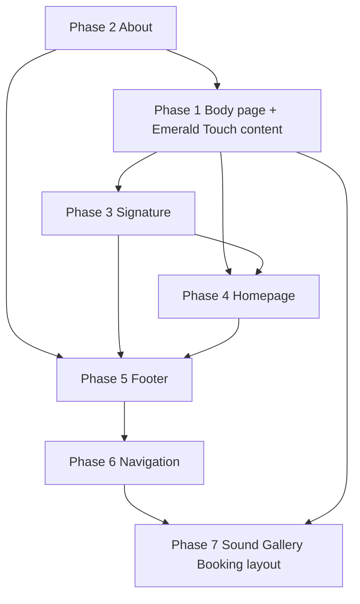

# Implementation Roadmap — PRANARTA Rebrand

**Status:** Planning only (no code changes in this document)  
**Sources:** `PROJECT_AUDIT.md` · `REBRANDING_PLAN.md` · `VISUAL_DIRECTION.md`  
**Last updated:** June 4, 2026

---

## Revision note (navigation & Body page)

This roadmap **supersedes** route/nav assumptions in `REBRANDING_PLAN.md` where they conflict:

| Topic | Earlier plan | **This roadmap** |
|-------|----------------|------------------|
| Body route | `/emerald-touch` replaces `/body` | **`/body` stays** — file `app/body/page.tsx` |
| Nav label | “Emerald Touch” in header | **“Body”** in header |
| Emerald Touch | Top-level page / nav item | **Signature method inside the Body page** |
| Primary navigation | 6–7 items incl. Emerald Touch, Signature, About | **5 items:** Home · Sound · Body · Gallery · Booking |
| New pages | — | **`/about`** and **`/signature`** (not in primary nav) |

**Kept unchanged:** Sound, Body, Gallery, Booking pages (content rework where noted).  
**No** `/body` → `/emerald-touch` redirect.

---

## 1. Overview

### 1.1 Goal

Rebrand the site to **PRANARTA** — *Where Sound Meets Body* — with Tom Van Geem as practitioner, luxury Ibiza positioning, and clear offers: **Sound**, **Body** (home of **Emerald Touch**), and **Signature Experiences** (combined). Avoid spiritual/wellness clichés per `VISUAL_DIRECTION.md`.

### 1.2 Target information architecture (end state)

```
/                     Home (reworked messaging)
/sound                Sound Experiences (keep route; content rework in Phase 7+)
/body                 Body (keep route & nav label; Emerald Touch method inside)
/signature            Signature Experiences (new — not in primary nav)
/about                About (new — not in primary nav)
/gallery              Gallery (keep route; enhancements in Phase 7+)
/booking              Booking (keep route; card copy updates in Phase 7+)
```

### 1.3 Primary navigation (locked)

| Order | Label | Route |
|-------|-------|-------|
| 1 | Home | `/` |
| 2 | Sound | `/sound` |
| 3 | Body | `/body` |
| 4 | Gallery | `/gallery` |
| 5 | Booking | `/booking` |

**Not in primary nav:** About (`/about`), Signature (`/signature`).  
Discover via: homepage CTAs, Body/Sound/Signature cross-sells, footer secondary links (Phase 5).

### 1.4 Execution order (priorities)

| Phase | Priority | Deliverable |
|-------|----------|-------------|
| **1** | 1 | **Body page** rework — Emerald Touch as signature method on `/body` |
| **2** | 2 | **About** page (`/about`) |
| **3** | 3 | **Signature** page (`/signature`) |
| **4** | 4 | **Homepage** messaging & structure |
| **5** | 5 | **Footer** (brand + secondary links) |
| **6** | 6 | **Navigation** — PRANARTA logo; **keep 5 nav items** |

**Phase 7+:** Sound, Gallery, Booking content; `layout.tsx` metadata; shared constants — see §12.

### 1.5 Naming model (use consistently in copy)

| Term | Role |
|------|------|
| **PRANARTA** | Brand |
| **Tom Van Geem** | Practitioner |
| **Where Sound Meets Body** | Tagline |
| **Body** | Page name + nav label (`/body`) |
| **Emerald Touch** | Signature head massage **method** — hero subject **on the Body page**, not a separate page title in nav |
| **Signature Experiences** | Combined Sound + Emerald Touch — `/signature` page |

**Example nav vs. page hero:** Nav says **Body** → page hero eyebrow can be **Body** with H1 introducing **Emerald Touch** (see Phase 1).

### 1.6 Principles during implementation

- Reuse existing patterns: `Reveal`, heroes, gold/beige CTAs, hardcoded arrays.
- Copy first: no chakra/energy-healing headline language.
- Optional `lib/site.ts` for WhatsApp prefills and image URLs (recommended Phase 1).

---

## 2. Pre-flight checklist (before Phase 1)

| # | Item | Owner | Notes |
|---|------|-------|-------|
| 1 | Confirm **15+ years** for Emerald Touch | Tom | On Body page, not nav |
| 2 | Approve **emerald accent** hex (`#3d5c4e` per visual doc) | Design | Body page + badges only |
| 3 | Fix email: `pranartra7` vs `pranarta7` | Tom | Phase 5 |
| 4 | Map blob images → Body / Sound / Signature | Content | §2.1 |
| 5 | WhatsApp opener: “Hello Tom” vs “Hello PRANARTA” | Tom | All prefills |
| 6 | About page bio facts | Tom | Phase 2 |
| 7 | Signature arc order (flexible vs fixed) | Tom | Phase 3 |
| 8 | Confirm About/Signature live **only** off-nav | Stakeholder | Matches §1.3 |

### 2.1 Interim image mapping (until new shoot)

| Use | Current blob (from audit) |
|-----|---------------------------|
| Body hero | Head massage `...23.27.24-sHKAV8...` |
| Body method / journey | Same or `...23.j27.24-lJSYqpe...` |
| Body setting | `...nat%2023.27.24-fhHO9c...` |
| About portrait | `...22.34.11-E7LucU...` or best portrait |
| Signature / home | Handpan `d.png-...` + massage asset (no duplicate in same viewport) |

---

## 3. Phase 1 — Body page (Emerald Touch inside)

**Priority:** 1  
**Route:** `app/body/page.tsx` (**keep** — refactor in place)  
**Nav:** **Body** → `/body` (unchanged)

### 3.1 Objectives

- Keep **Body** as the public page and navigation name.
- Reframe page content around **Emerald Touch** as the signature head massage method (15+ years).
- Replace generic “Body Experiences” / three spa-style cards with narrative sections from `REBRANDING_PLAN.md` §5 (adapted for Body page naming).
- Apply emerald accent sparingly on this page (`VISUAL_DIRECTION.md` §5.3).
- **Do not** create `app/emerald-touch/` or change the URL.

### 3.2 Files to modify

| Action | File |
|--------|------|
| **Modify** | `app/body/page.tsx` — full content/structure rework |
| **Modify** | `app/globals.css` — optional `--emerald` tokens |
| **Optional** | `lib/site.ts` — shared links, images, WhatsApp prefills |
| **Do not** | Delete `app/body/page.tsx`, add redirects, or add `/emerald-touch` |

**Phase 7 (same pass or later):** `app/sound/page.tsx` cross-sell copy (“Emerald Touch on Body page”) — href stays `/body`.

### 3.3 Recommended hero hierarchy (Body page)

Nav says **Body**; page leads with the method:

| Element | Copy slot |
|---------|-----------|
| Eyebrow | `Body` |
| H1 | `Emerald Touch` |
| Subhead | *Signature head massage · developed through 15+ years of practice* |
| Intro line | 1–2 sentences: 1:1 private sessions, Ibiza villas & retreats |

This makes Emerald Touch the **hero story** without renaming the site section in navigation.

### 3.4 Page structure (implement in order)

| # | Section | Content requirements |
|---|---------|----------------------|
| 1 | **Hero** | As §3.3; intimate imagery; gradient overlay unchanged |
| 2 | **The method** | What Emerald Touch is — presence, deep relaxation, nervous system calm; **no** H2 “Energy Work” |
| 3 | **The journey** | Arrival · Touch · Stillness · Integration |
| 4 | **Who it’s for** | Private guests, post-travel, retreat guests, after a Sound experience |
| 5 | **Setting** | Villas, quiet rooms, 1:1, discretion |
| 6 | **Tom’s lineage** | Short block → link **`/about`** |
| 7 | **Pairing with Sound** | Emerald Touch before/after live music → CTA **`/signature`** (primary), **`/sound`** (secondary) |
| 8 | **CTA** | WhatsApp: book **Emerald Touch** / Body session on `/body` (wording per §3.6) |

**Remove:** alternating cards titled “Deep Head Massage,” “Energy Work,” “1:1 Private Sessions” as primary structure. Fold substance into §2–5; one optional muted paragraph if Reiki/influences must be mentioned — not a headline.

### 3.5 Content migration map

| Current Body page | New home |
|-------------------|----------|
| Eyebrow “Body Experiences” | Eyebrow **Body** |
| H1 “Head Massage & Bodywork” | H1 **Emerald Touch** |
| Card: Deep Head Massage | § The method + § The journey |
| Card: Energy Work | One paragraph under method — no energy-healing H2 |
| Card: 1:1 Private Sessions | § Setting + § Who it’s for |
| Cross-sell “Explore Sound Experiences” | Keep → `/sound` |

### 3.6 Metadata (page-level export)

```ts
title: 'Body | Emerald Touch | PRANARTA | Ibiza'
description: 'Body — home of Emerald Touch, Tom Van Geem’s signature head massage method refined over 15+ years. Private sessions in Ibiza.'
```

### 3.7 Visual notes

- “15+ years” badge: emerald accent on charcoal — not on gold buttons.
- Emerald Touch sections may use subtle `border-emerald/30` dividers; CTAs remain gold.

### 3.8 Acceptance criteria

- [ ] `/body` loads reworked page; **no** `/emerald-touch` route added.
- [ ] Nav label **Body** still points to `/body`.
- [ ] **Emerald Touch** appears in H1 (or equivalent primary headline), not buried.
- [ ] No “Body Experiences” as main category label on page.
- [ ] No “Energy Work” as section H2.
- [ ] WhatsApp CTA references Emerald Touch and/or Body session.
- [ ] Link to `/about` from lineage block.

### 3.9 Estimated effort

**Medium** — single file refactor + optional CSS tokens.

---

## 4. Phase 2 — About page

**Priority:** 2  
**Route:** `app/about/page.tsx` (new)  
**Primary nav:** not listed — linked from Body, homepage, footer

### 4.1 Objectives

- Tom Van Geem credibility without competing with PRANARTA brand.
- Support Body page “Tom’s lineage” and overall trust.
- Factual, warm tone — no spiritual origin-story clichés.

### 4.2 Page structure

| # | Section | Content |
|---|---------|---------|
| 1 | **Hero** | Tom Van Geem · PRANARTA · practitioner & artist · Ibiza |
| 2 | **Intro** | Sound + touch practice; private luxury settings |
| 3 | **Two paths** | Sound → `/sound` · Body / Emerald Touch → `/body` |
| 4 | **Story** | How the practice formed; villas & retreats |
| 5 | **Ibiza** | Place, season, discretion |
| 6 | **Portrait** | One documentary image |
| 7 | **Signature bridge** | CTA → `/signature` |
| 8 | **Connect** | WhatsApp · @pranarta7 · email |

### 4.3 Files

| Action | File |
|--------|------|
| **Create** | `app/about/page.tsx` |

### 4.4 Metadata

```ts
title: 'About | Tom Van Geem | PRANARTA | Ibiza'
description: 'Tom Van Geem — handpan artist and creator of Emerald Touch. PRANARTA private experiences in Ibiza.'
```

### 4.5 Acceptance criteria

- [ ] `/about` live; linked from Body page §6.
- [ ] Links to `/body` (not `/emerald-touch`), `/sound`, `/signature`.
- [ ] Not added to primary nav (§1.3).

### 4.6 Estimated effort

**Medium** — new page; bio-dependent.

---

## 5. Phase 3 — Signature page

**Priority:** 3  
**Route:** `app/signature/page.tsx` (new)  
**Primary nav:** not listed — homepage hero CTA, cross-sells, footer

### 5.1 Objectives

- Flagship offer: **Sound + Emerald Touch** (method from Body page) in one arc.
- Highest-intent WhatsApp prefill.
- Full-bleed emotional band per `VISUAL_DIRECTION.md` §2.7.

### 5.2 Page structure

| # | Section | Content |
|---|---------|---------|
| 1 | **Hero** | *Where Sound Meets Body* — complete PRANARTA experience |
| 2 | **The arc** | Sound opening → Emerald Touch → sound landing (order flexible) |
| 3 | **Scenarios** | Villa welcome · retreat closing · private celebration |
| 4 | **What’s included** | Consultation, live performance, Emerald Touch session — qualitative |
| 5 | **Gallery tie-in** | 2–3 combined-evening images |
| 6 | **Cross-sell** | `/sound` and `/body` for à la carte |
| 7 | **CTA** | WhatsApp: design a Signature Experience |

### 5.3 Copy rule

Say **Emerald Touch** for the touch element; say **Body** when pointing users to the method’s home: “Learn about Emerald Touch on the **Body** page” → `/body`.

### 5.4 Metadata

```ts
title: 'Signature Experiences | PRANARTA | Ibiza'
description: 'Signature Experiences — Sound and Emerald Touch combined. Private evenings in Ibiza with Tom Van Geem.'
```

### 5.5 Acceptance criteria

- [ ] `/signature` live; not in primary nav.
- [ ] Cross-sells use `/body` and `/sound`.
- [ ] Ready for homepage primary CTA (Phase 4).

### 5.6 Estimated effort

**Medium** — new page; reuse existing layout patterns.

---

## 6. Phase 4 — Homepage messaging

**Priority:** 4  
**File:** `app/page.tsx`  
**Depends on:** `/body` rework, `/about`, `/signature` exist

### 6.1 Objectives

- PRANARTA-led hero; tagline; Tom as eyebrow.
- Route visitors to Sound, **Body** (Emerald Touch), and Signature without changing nav model.
- Align with `VISUAL_DIRECTION.md` §2 where compatible with 5-item nav.

### 6.2 Section transformation map

| Current | Action | New |
|---------|--------|-----|
| Hero: Tom as H1 | Replace | PRANARTA H1, tagline, Tom eyebrow |
| “Where Sound Meets Body” | Keep/refine | Fusion band |
| 2 cards: Sound + Body | Replace | **3 cards:** Sound · **Body** (subtitle: *Emerald Touch*) · Signature |
| — | Add | Sound format strip → `/sound` |
| — | Add | **Body preview** — asymmetric block, 15+ years badge, link **`/body`** |
| — | Add | Signature highlight → `/signature` |
| Gallery preview | Expand | 4 images; hero ≠ gallery URLs |
| CTA | Keep | WhatsApp + Instagram |
| — | Add | Ibiza trust line; optional About link |

### 6.3 Pillar card copy (homepage)

| Card title | Subtitle / line | Links to |
|------------|-----------------|----------|
| Sound | Live handpan · electro acoustic · hybrid | `/sound` |
| **Body** | *Emerald Touch* — signature head massage | `/body` |
| Signature | Sound and Touch combined | `/signature` |

**Nav stays “Body”;** card can tease Emerald Touch in one line — do not rename card to “Emerald Touch” only (unless stakeholder prefers “Body · Emerald Touch” as card H3).

### 6.4 Hero spec

| Element | Copy |
|---------|------|
| Eyebrow | Tom Van Geem |
| H1 | PRANARTA |
| Subhead | Where Sound Meets Body |
| Support | Private Sound · Body · Signature Experiences — Ibiza |
| Primary CTA | `/signature` |
| Secondary CTA | WhatsApp (PRANARTA general) |

### 6.5 Links — explicit rules

| Use | Route |
|-----|-------|
| Body nav & body card | `/body` |
| Emerald Touch story | `/body` (never `/emerald-touch`) |
| Signature | `/signature` |
| Tom’s story | `/about` (secondary link, not nav) |

### 6.6 Acceptance criteria

- [ ] PRANARTA + tagline above fold.
- [ ] Body card links to `/body`; mentions Emerald Touch.
- [ ] No `/emerald-touch` links anywhere.
- [ ] Primary nav unchanged in count/labels (header updated Phase 6).
- [ ] Hero image not duplicated in gallery block.

### 6.7 Estimated effort

**Large**

---

## 7. Phase 5 — Footer

**Priority:** 5  
**File:** `components/footer.tsx`

### 7.1 Objectives

- PRANARTA brand block + Tom subline/tagline.
- **Primary service links** align with nav: Sound, Body, Gallery, Booking.
- **Secondary links** for pages not in nav: Signature, About.

### 7.2 Changes checklist

| Element | Target |
|---------|--------|
| Brand | **PRANARTA** + Tom Van Geem + tagline |
| Blurb | Sound · Body (Emerald Touch) · Signature — Ibiza |
| Main links | Home, Sound, **Body** `/body`, Gallery, Booking |
| Secondary | Signature `/signature`, About `/about` |
| Body label | **Body** (not “Emerald Touch” as link text) |
| Copyright | PRANARTA · Tom Van Geem |
| Email | Corrected address |

### 7.3 Footer IA (recommended)

```
[ PRANARTA · tagline · Ibiza ]     [ Explore ]              [ Connect ]
                                    Home                     Instagram
                                    Sound                    WhatsApp
                                    Body                     Email
                                    Gallery
                                    Booking
                                    ——
                                    Signature Experiences
                                    About
```

### 7.4 Acceptance criteria

- [ ] Footer **Body** → `/body`.
- [ ] Signature & About in footer only (or under “Explore”), not replacing Body.
- [ ] No `/emerald-touch` link.

### 7.5 Estimated effort

**Small**

---

## 8. Phase 6 — Navigation

**Priority:** 6  
**File:** `components/header.tsx`

### 8.1 Objectives

- **PRANARTA** wordmark (gold, tracked).
- **Preserve exact five nav items:** Home · Sound · Body · Gallery · Booking.
- Mobile menu + WhatsApp/Instagram blocks updated for brand prefills.
- Active state for `/body` unchanged.

### 8.2 Primary nav (locked — do not extend)

| # | Label | href |
|---|-------|------|
| 1 | Home | `/` |
| 2 | Sound | `/sound` |
| 3 | **Body** | `/body` |
| 4 | Gallery | `/gallery` |
| 5 | Booking | `/booking` |

**Do not add** About, Signature, or Emerald Touch to this array.

### 8.3 Logo area

| Element | Treatment |
|---------|-----------|
| Link | `/` |
| Primary | `PRANARTA` |
| Subline (optional, `lg+`) | `Tom Van Geem` muted |

### 8.4 Discoverability for About & Signature

| Entry point | Placement |
|-------------|-----------|
| Homepage | Signature CTA; Body card; optional “About Tom” text link |
| Body page | About lineage link |
| Footer | Secondary links (Phase 5) |
| Sound page (Phase 7) | Cross-sell Signature + Body |

### 8.5 Acceptance criteria

- [ ] Nav array has exactly **5** items, includes **Body** → `/body`.
- [ ] Logo reads PRANARTA.
- [ ] No Emerald Touch nav item; no `/emerald-touch`.
- [ ] `/about` and `/signature` work but are absent from header nav.

### 8.6 Estimated effort

**Small** — logo + prefills; nav labels unchanged

---

## 9. Dependency graph



**Suggested PRs:**

- **A:** Phase 1 (`app/body/page.tsx` + emerald CSS)  
- **B:** Phases 2 + 3 (About + Signature)  
- **C:** Phase 4 (Homepage)  
- **D:** Phases 5 + 6 (Footer + Header logo; nav locked)  
- **E:** Phase 7 (Sound, Booking, Gallery, layout metadata)

---

## 10. Cross-cutting tasks

| Task | P1 | P2 | P3 | P4 | P5 | P6 |
|------|----|----|----|----|----|-----|
| `metadata` export | ✓ | ✓ | ✓ | layout | — | — |
| WhatsApp prefill | ✓ | ✓ | ✓ | ✓ | ✓ | ✓ |
| `Reveal` | ✓ | ✓ | ✓ | ✓ | — | — |
| Alt text `PRANARTA — …` | ✓ | ✓ | ✓ | ✓ | — | — |
| Emerald token | ✓ | — | — | badge | — | — |

---

## 11. Testing plan

1. `/body` works; no `/emerald-touch` 404 or redirect expected.  
2. Header nav = 5 items; **Body** active state on `/body`.  
3. Homepage + footer: all Body links → `/body`.  
4. Signature + About reachable from homepage/footer/Body; **not** in header nav.  
5. Search repo: no erroneous `/emerald-touch` hrefs after Phase 4–6.  
6. Copy scan: no “Body Experiences” H1; no “Energy Work” H2 on Body page.  
7. Responsive + `npm run build`.

---

## 12. Phase 7+ — Backlog (keep existing routes)

### 12.1 Sound (`app/sound/page.tsx`)

- Three offerings: Handpan · Electro Acoustic · DJ & Hybrid.  
- Cross-sell: **Body** (`/body`) for Emerald Touch; **Signature** (`/signature`).  
- Copy: “Add Emerald Touch” not “visit Emerald Touch page” as separate product URL.

### 12.2 Booking (`app/booking/page.tsx`)

- Keep route; update cards e.g. **Body** — *Emerald Touch session* (description), href WhatsApp prefill mentions Emerald Touch.  
- Add **Signature Experience** card; keep Sound, Villa, Retreat as per `REBRANDING_PLAN.md` §8.2 adapted.

### 12.3 Gallery (`app/gallery/page.tsx`)

- Optional row labels: Sound · Body / Emerald Touch · Signature · Ibiza.  
- Keep `/gallery` in nav.

### 12.4 Layout (`app/layout.tsx`)

- PRANARTA-first default metadata.

### 12.5 Shared constants (`lib/site.ts`)

```ts
// Conceptual
export const NAV = [
  { name: 'Home', href: '/' },
  { name: 'Sound', href: '/sound' },
  { name: 'Body', href: '/body' },
  { name: 'Gallery', href: '/gallery' },
  { name: 'Booking', href: '/booking' },
]
export const SECONDARY_LINKS = [
  { name: 'Signature Experiences', href: '/signature' },
  { name: 'About', href: '/about' },
]
```

### 12.6 Other

- WhatsApp float PRANARTA prefill; OG image; favicon.

---

## 13. Risk register

| Risk | Mitigation |
|------|------------|
| Users miss About/Signature (not in nav) | Strong homepage + footer secondary links |
| “Body” vs “Emerald Touch” confusion | Clear Body page hero (§3.3); card subtitle on home |
| `REBRANDING_PLAN.md` says `/emerald-touch` | This roadmap overrides; update that doc separately if needed |
| Old “Body Experiences” copy remains | Grep + §11 checklist |
| Email typo | Confirm before Phase 5 |

---

## 14. Success metrics (launch)

- [ ] Primary nav = **Home · Sound · Body · Gallery · Booking** only.  
- [ ] `/body` presents **Emerald Touch** as signature method with 15+ years.  
- [ ] No `/emerald-touch` route or nav item.  
- [ ] `/about` and `/signature` live and linked from home/footer/Body.  
- [ ] PRANARTA visible in homepage hero without scroll.  
- [ ] Sound, Gallery, Booking routes still work.  
- [ ] Visual/copy aligns with `VISUAL_DIRECTION.md` avoid list.

---

## 15. Relation to other docs

| Document | Note |
|----------|------|
| `REBRANDING_PLAN.md` | Content sections for Emerald Touch & Signature still apply **inside** `/body` and `/signature`; ignore `/emerald-touch` IA unless that doc is revised. |
| `VISUAL_DIRECTION.md` | Homepage “Emerald Touch preview” → **Body preview** linking to `/body`. |
| `PROJECT_AUDIT.md` | Baseline; Body route and nav preserved. |

---

## 16. Document index

| File | Role |
|------|------|
| `PROJECT_AUDIT.md` | Technical baseline |
| `REBRANDING_PLAN.md` | Copy architecture (partial override — see §Revision) |
| `VISUAL_DIRECTION.md` | Look & feel |
| `IMPLEMENTATION_ROADMAP.md` | **This file** — execution order & nav lock |

---

*End of implementation roadmap. No code has been modified.*
