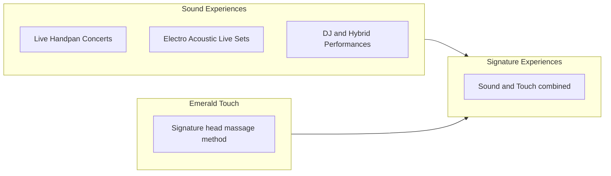

# Rebranding Plan — PRANARTA

**Status:** Strategy & content architecture only (no code changes)  
**Based on:** `PROJECT_AUDIT.md`  
**Date:** June 4, 2026

---

## 1. Brand foundation

### 1.1 Hierarchy

| Layer | Role | Usage |
|-------|------|--------|
| **PRANARTA** | Primary brand | Logo wordmark, browser title lead, header, footer, social handles, “book PRANARTA” language |
| **Tom Van Geem** | Artist & practitioner | Subline under PRANARTA, About-adjacent trust, press/bio, “performed by / facilitated by” |
| **Where Sound Meets Body** | Master tagline | Hero, OG description, section bridges, Signature Experiences framing |

**Principle:** Visitors remember **PRANARTA**; they trust **Tom Van Geem**; they understand the promise via **Where Sound Meets Body**.

### 1.2 Positioning (unchanged core, refined language)

- **Geography:** Ibiza — villas, terraces, retreats, private events, Es Vedrá–adjacent mood where relevant.
- **Tier:** Luxury, intimate, invitation-only feel — never festival-mainstage or clinical spa brochure.
- **Audience:** Villa hosts, retreat organizers, private guests, curators of intimate gatherings.
- **Tone:** Calm authority, sensory language, short sentences, no hype discounts or “wellness industry” clichés.

### 1.3 What changes vs. current site (audit)

| Current | Rebrand |
|---------|---------|
| “Tom Van Geem” as logo | **PRANARTA** logo + “Tom Van Geem” subline |
| `/body` — generic “Body Experiences” | **`/emerald-touch`** — named method, 15+ years story |
| Sound: 4 mixed offerings | Sound: **3 clear performance tiers** |
| Cross-sell only between Sound ↔ Body | **Signature Experiences** as first-class pillar |
| Split Pranarta / Tom naming | Unified PRANARTA with Tom as human face |

### 1.4 Proposed information architecture

```
/                     Home
/sound                Sound Experiences
/emerald-touch        Emerald Touch
/signature            Signature Experiences (Sound + Touch)
/gallery              Gallery
/booking              Booking
```

**Redirects (implementation note for later):** `/body` → `/emerald-touch` (301).

**Primary navigation (5 items):** Home · Sound · Emerald Touch · Signature · Gallery · Booking  
*(Booking can remain nav item or become persistent CTA only — see §7.)*

---

## 2. Service architecture (three pillars)

### 2.1 Pillar map



| Pillar | One-line promise | Primary CTA |
|--------|------------------|-------------|
| **Sound Experiences** | Live music that holds space — from pure handpan to hybrid sets | “Book Sound” |
| **Emerald Touch** | A signature head massage method refined over 15+ years | “Book Emerald Touch” |
| **Signature Experiences** | Sound and Touch in one curated arc | “Design Your Experience” |

### 2.2 Sound Experiences — content definitions

#### Live Handpan Concerts

- **What it is:** Acoustic handpan as the centrepiece — live, unhurried, ceremony-like.
- **Settings:** Sunset terraces, villa gardens, intimate dinners, welcome rituals for retreats.
- **Guest feeling:** Stillness, beauty, presence — “the room listens.”
- **Differentiator vs. other two:** No electronics; maximum purity and intimacy.

#### Electro Acoustic Live Sets

- **What it is:** Handpan plus live looping, organic textures, subtle electronic layers — performed live, not a DJ set.
- **Settings:** Longer villa evenings, creative gatherings, brands that want atmosphere with artistry.
- **Guest feeling:** Immersion, depth, cinematic mood without losing the human touch.
- **Differentiator:** Live musicianship + electronic colour; still a **performance**, not a playlist.

#### DJ & Hybrid Performances

- **What it is:** Curated DJ journeys with optional live handpan overlays — hybrid energy for later hours or larger villa zones.
- **Settings:** Pool areas, after-dinner flow, events needing movement while staying refined.
- **Guest feeling:** Elevated celebration — Ibiza sophistication, not club chaos.
- **Differentiator:** Scale and energy; **hybrid** = live elements where it matters.

**Cross-pillar line (for Sound page footer):**  
*All Sound Experiences can be woven into a Signature Experience with Emerald Touch.*

### 2.3 Emerald Touch — content definitions

#### Brand within the brand

- **Name:** Emerald Touch — always capitalised; never “head massage page.”
- **Story anchor:** Developed through **15+ years of practice** — lineage, refinement, trust.
- **Method framing:** Signature **method**, not a menu of spa add-ons. One primary narrative; optional short bullets for what guests receive (nervous system reset, deep cranial relaxation, presence-based touch) without diluting the brand name.

#### What to avoid

- Generic “bodywork” or “energy work” as page title (can appear as supporting detail under the method).
- Competing sub-brands (Reiki, etc.) unless folded into “what informs the method” in one subtle paragraph.

#### Tone

- Quiet luxury, therapeutic mastery, 1:1 private sessions in Ibiza villas or retreat spaces.

### 2.4 Signature Experiences — content definitions

- **What it is:** A single session or evening **arc** designed by Tom — sound journey + Emerald Touch in intentional sequence (e.g. sound bath → touch, or touch → handpan landing).
- **Settings:** The flagship offer for hosts who want the full PRANARTA promise.
- **Guest feeling:** “This is why you came to Ibiza.”
- **Sales logic:** Highest intent, highest customization; default WhatsApp path for villa/retreat inquiries.

---

## 3. Homepage structure

**Goal:** Establish PRANARTA + tagline in 5 seconds; route to three pillars; convert via WhatsApp without overwhelming choice.

### 3.1 Section order

| # | Section | Purpose | Key content |
|---|---------|---------|-------------|
| 1 | **Hero** | Brand + desire | PRANARTA · Tom Van Geem · *Where Sound Meets Body* · one-line Ibiza luxury · dual CTA: Explore Signature / Book on WhatsApp |
| 2 | **The fusion** (short) | Tagline payoff | 2–3 sentences: sound and touch as one practice; villas, retreats, private gatherings |
| 3 | **Three pillars** | Navigation hub | Three equal cards: Sound · Emerald Touch · Signature — each with one sentence + “Explore” |
| 4 | **Sound preview** | Depth tease | Three mini-columns or horizontal strip: Handpan Concerts · Electro Acoustic · DJ & Hybrid — link to `/sound` |
| 5 | **Emerald Touch preview** | Method tease | Portrait-forward block; “15+ years” badge; link to `/emerald-touch` |
| 6 | **Signature highlight** | Hero product | One emotional paragraph + single strong CTA to `/signature` |
| 7 | **Gallery preview** | Proof | 3–4 curated images (sound, touch, Ibiza context) — link to `/gallery` |
| 8 | **Ibiza & availability** | Trust | Season note (if applicable), location line, discretion/privacy line for villa clients |
| 9 | **Closing CTA** | Conversion | WhatsApp primary · Instagram secondary · optional email |

### 3.2 Hero copy architecture (draft slots)

- **Eyebrow:** Tom Van Geem  
- **H1:** PRANARTA  
- **Subhead (serif):** Where Sound Meets Body  
- **Supporting line:** Private Sound · Emerald Touch · Signature Experiences — Ibiza  
- **Primary button:** Signature Experiences → `/signature`  
- **Secondary button:** Book on WhatsApp (general prefill)

### 3.3 Homepage SEO / metadata direction

- **Title:** PRANARTA — Where Sound Meets Body \| Tom Van Geem \| Ibiza  
- **Description:** Lead with Signature + three pillars; include handpan, Emerald Touch, private villa.

### 3.4 What to retire from current homepage

- “Explore Sound / Explore Body” as the only paths — replaced by **three-pillar** grid + Signature highlight.
- Tom Van Geem as H1 — demoted to eyebrow/subline.

---

## 4. Sound page structure (`/sound`)

**Goal:** Clarify three performance products; help hosts pick format; upsell Signature.

### 4.1 Section order

| # | Section | Content |
|---|---------|---------|
| 1 | **Hero** | Eyebrow: Sound Experiences · H1: Live Music for Private Ibiza · subcopy on intimacy and scale |
| 2 | **Format selector intro** | One paragraph: three ways to shape the evening — acoustic, electro acoustic, hybrid/DJ |
| 3 | **Offering 1 — Live Handpan Concerts** | Full-width alternating layout: image · title · 3–4 sentences · “Ideal for” bullets (sunset, dinner, ritual) |
| 4 | **Offering 2 — Electro Acoustic Live Sets** | Same pattern · emphasize live looping / organic electronic |
| 5 | **Offering 3 — DJ & Hybrid Performances** | Same pattern · emphasize energy, later hours, live overlay option |
| 6 | **Comparison strip** (optional) | Simple 3-column: Mood · Scale · Electronics — helps decision without pricing table |
| 7 | **Settings & logistics** | Villas, retreats, events; sound requirements; discretion; no public pricing unless business decides later |
| 8 | **Cross-sell — Emerald Touch** | “Add Emerald Touch before or after the set” → `/emerald-touch` |
| 9 | **Cross-sell — Signature** | “Or design a full arc” → `/signature` |
| 10 | **CTA** | WhatsApp prefill: sound inquiry (format-agnostic or three buttons with prefills per format) |

### 4.2 Content per offering (architecture)

Each offering block should include:

1. **Title** (H2)  
2. **Sensory paragraph** (what it feels like)  
3. **Practical paragraph** (duration band, space, guest count — qualitative, not contract)  
4. **Ideal for** (3 bullets)  
5. **Image** (dedicated asset per format when assets exist; until then, map best-fit from current blob library)

### 4.3 Migration from current Sound page

| Current block | Maps to |
|---------------|---------|
| Live Handpan Sessions | **Live Handpan Concerts** |
| Organic Electronic Journeys | **Electro Acoustic Live Sets** |
| Sunset Performances | Fold into Handpan + Electro copy as “settings” |
| Villa & Private Events | Fold into all three as “settings” |

### 4.4 WhatsApp prefill strategy (Sound)

- **Generic:** “Hello, I’d like to book a Sound Experience with PRANARTA in Ibiza.”  
- **Format-specific (optional buttons):** Handpan / Electro Acoustic / DJ & Hybrid — each adds one line to the message.

---

## 5. Emerald Touch page structure (`/emerald-touch`)

**Goal:** Own the method name; build authority (15+ years); 1:1 private luxury; bridge to Signature.

### 5.1 Section order

| # | Section | Content |
|---|---------|---------|
| 1 | **Hero** | Eyebrow: Emerald Touch · H1: Signature Head Massage · sub: *Developed through 15+ years of practice* |
| 2 | **The method** | What Emerald Touch is — philosophy of touch, presence, nervous system calm; **not** a list of competing modalities |
| 3 | **The journey** | What a session feels like — arrival, touch, stillness, integration (4 beats, no timestamps required) |
| 4 | **Who it’s for** | Private guests, post-travel reset, retreat participants, post-sound landing |
| 5 | **Setting** | Ibiza villas, quiet rooms, retreat spaces; 1:1 only; discretion |
| 6 | **Tom’s lineage** (short) | Tom Van Geem — practitioner face; years of practice; optional one line on what informs the method (kept minimal) |
| 7 | **Pairing with Sound** | “Emerald Touch alone, or as part of Signature” → `/signature` |
| 8 | **Cross-sell — Sound** | Optional live handpan before/after → `/sound` |
| 9 | **CTA** | WhatsApp prefill: Emerald Touch inquiry |

### 5.2 Messaging guardrails

- **Always say:** Emerald Touch, signature method, 15+ years.  
- **Say sparingly:** Reiki, energy work — only if needed for SEO footnote, not as H2s.  
- **Never say:** “Body Experiences” as a category label.

### 5.3 Migration from current Body page

| Current block | Maps to |
|---------------|---------|
| Deep Head Massage | Core of **The method** + **The journey** |
| Energy Work | Supporting detail under method (one paragraph max) |
| 1:1 Private Sessions | **Setting** + **Who it’s for** |

### 5.4 URL & naming

- **Route:** `/emerald-touch`  
- **Nav label:** Emerald Touch  
- **Footer:** Emerald Touch  

---

## 6. Signature Experiences page (new — recommended)

*Not in your numbered list but required by the three-pillar model; keep in plan as its own route.*

### 6.1 Section order

| # | Section | Content |
|---|---------|---------|
| 1 | **Hero** | Where Sound Meets Body — the complete PRANARTA experience |
| 2 | **The arc** | How Tom designs flow: sound opening → Emerald Touch → sound landing (flexible order explained) |
| 3 | **Example scenarios** | Villa welcome night · retreat closing · private celebration (3 cards, no rigid packages) |
| 4 | **What’s included** (conceptual) | Consultation, customization, live performance element, Emerald Touch session — qualitative |
| 5 | **Gallery tie-in** | 2–3 images showing combined moments |
| 6 | **CTA** | WhatsApp: “Design a Signature Experience” — highest-intent prefill |

### 6.2 Homepage vs. dedicated page

- **Homepage:** Teaser + CTA.  
- **`/signature`:** Full story — avoids overcrowding home.

---

## 7. Gallery strategy

### 7.1 Purpose

- **Prove** luxury Ibiza context and live presence (not stock wellness).  
- **Support** three pillars visually — guests should see which images belong to Sound, Emerald Touch, or Signature.  
- **Feed** Instagram without duplicating the entire feed on-site.

### 7.2 Structure (`/gallery`)

| # | Section | Approach |
|---|---------|----------|
| 1 | **Hero** | Minimal — “Gallery” + optional subline: Moments in Ibiza |
| 2 | **Filtered grid** (recommended) | Three tabs or labeled rows: **Sound** · **Emerald Touch** · **Signature** · **Ibiza** |
| 3 | **Featured strip** | 1 hero image per pillar (4 total if Ibiza separate) |
| 4 | **Instagram bridge** | Follow @pranarta7 for more — tiles may link to IG post if URLs known, else profile |

### 7.3 Asset strategy (from audit)

**Current state:** 6 remote blob images; heavy reuse; WhatsApp-style filenames.

**Rebrand actions (content/ops, not code):**

1. **Shoot or select** minimum 9 assets: 3 Sound, 2 Emerald Touch, 2 Signature, 2 Ibiza landscape/villa context.  
2. **Rename & host** on stable CDN with semantic filenames (`pranarta-handpan-sunset.jpg`, etc.).  
3. **Alt text rules:** `PRANARTA — [pillar] — [description] — Ibiza` for SEO and accessibility.  
4. **Retire** ambiguous alts (“Tom Van Geem Experiences” vs “Pranarta Experiences”) — use pillar names consistently.

### 7.4 Homepage gallery preview

- Show **4 images max**: one per pillar + one Ibiza mood.  
- Do not repeat the same handpan photo in hero and gallery preview (audit issue today).

### 7.5 Motion & interaction (strategy only)

- Keep hover subtle (border gold, slight scale) — matches existing luxury UI.  
- Optional later: lightbox — not required for v1 rebrand.  
- **Do not** make every tile only link to Instagram (reduces on-site credibility); use IG for “more,” not as the only depth.

---

## 8. Booking strategy

### 8.1 Principles

- **WhatsApp remains primary** — matches audit, Ibiza luxury concierge habit.  
- **Reduce choice paralysis** on booking page by aligning cards to **pillars + context**, not overlapping services.  
- **Prefill messages** should say **PRANARTA** and name the pillar.

### 8.2 Proposed booking options (`/booking`)

Replace current six cards with **five**:

| Card | Description slot | WhatsApp prefill intent |
|------|------------------|-------------------------|
| **Signature Experience** | Sound + Emerald Touch combined | Design a Signature Experience in Ibiza |
| **Sound Experience** | Choose format on WhatsApp | Book Sound (Handpan / Electro Acoustic / DJ-Hybrid) |
| **Emerald Touch** | 1:1 signature session | Book Emerald Touch session |
| **Villa & Private Event** | Full evening curation | Villa / private event inquiry |
| **Retreat & Collaboration** | Multi-day / retreat partner | Retreat collaboration |

**Retire as separate cards:** “Body Session,” “Event Performance” (fold into Sound or Villa).

### 8.3 Booking page structure

| # | Section | Content |
|---|---------|---------|
| 1 | **Hero** | Book PRANARTA · Available in Ibiza for private sessions and events |
| 2 | **How it works** | 3 steps: WhatsApp → brief consultation → tailored proposal (no payment on site) |
| 3 | **Option grid** | Five cards above |
| 4 | **What to include in your message** | Date window, location, guest count, pillar interest — educates high-quality leads |
| 5 | **Secondary channels** | Instagram · Email (fix `pranartra7` vs `pranarta7` before launch) |
| 6 | **Expectations** | Response time, English (and other languages if applicable), privacy |

### 8.4 Global CTAs (all pages)

| Placement | Behavior |
|-----------|----------|
| Header (desktop) | Optional “Book” → `/booking` or direct WhatsApp |
| Mobile FAB | Keep; label mentally as “Book PRANARTA” |
| Footer | WhatsApp + Instagram + Email |
| Per-pillar pages | Pillar-specific WhatsApp prefill |

### 8.5 WhatsApp message templates (architecture)

**General:**
> Hello, I’d like to inquire about PRANARTA in Ibiza. [Pillar/Date/Guests]

**Signature:**
> Hello Tom, I’d like to design a Signature Experience (Sound + Emerald Touch) in Ibiza.

**Sound:**
> Hello Tom, I’m interested in a Sound Experience — [Handpan / Electro Acoustic / DJ & Hybrid].

**Emerald Touch:**
> Hello Tom, I’d like to book an Emerald Touch session in Ibiza.

**Villa / Retreat:**
> Hello Tom, I’m hosting a [villa evening / retreat] and would like to discuss PRANARTA.

---

## 9. Global content & SEO architecture

### 9.1 Metadata template

| Page | Title pattern |
|------|----------------|
| Home | PRANARTA \| Where Sound Meets Body \| Tom Van Geem \| Ibiza |
| Sound | Sound Experiences \| PRANARTA \| Ibiza |
| Emerald Touch | Emerald Touch \| Signature Head Massage \| PRANARTA \| Ibiza |
| Signature | Signature Experiences \| PRANARTA \| Ibiza |
| Gallery | Gallery \| PRANARTA \| Ibiza |
| Booking | Book \| PRANARTA \| Ibiza |

### 9.2 Keywords to weave (naturally)

- PRANARTA, Tom Van Geem, Ibiza private events, handpan concert, electro acoustic live, villa DJ hybrid, signature head massage, Emerald Touch, luxury retreat entertainment.

### 9.3 Legal & trust (post-rebrand backlog)

- Privacy note for WhatsApp/IG inquiries.  
- Imprint if EU business requires — not blocking creative launch but plan separately.

---

## 10. Header, footer & social alignment

### 10.1 Header

- **Logo text:** PRANARTA  
- **Subline (optional, desktop):** Tom Van Geem — small, gold or beige muted  
- **Nav:** Home · Sound · Emerald Touch · Signature · Gallery · Booking  

### 10.2 Footer

- **Brand block:** PRANARTA · Tom Van Geem · tagline · Ibiza  
- **Services column:** Sound · Emerald Touch · Signature  
- **Connect:** @pranarta7 (consistent casing), WhatsApp, corrected email  

### 10.3 Instagram

- Bio should mirror site hierarchy: three pillars + Signature + link to booking/WhatsApp.  
- Highlight covers: Sound · Emerald Touch · Signature · Ibiza.

---

## 11. Visual & experiential direction (strategy)

*Retain existing design system per audit — no code here.*

| Element | Direction |
|---------|-----------|
| Palette | Keep dark / gold / beige luxury |
| Typography | Keep Cormorant + Lato; PRANARTA wordmark may use slightly wider tracking |
| Photography | Warmer skin tones + golden hour + handpan metal + calm touch; avoid cluttered spa stock |
| Emerald Touch | Introduce subtle **emerald** as accent only (eyebrow, divider, or “15+ years” badge) — do not replace gold primary |
| Motion | Keep Reveal scroll animations; consider particles only on Signature hero if ever enabled |

---

## 12. Implementation phases (for when code begins)

| Phase | Scope |
|-------|--------|
| **1 — Copy & IA** | Nav, routes, redirects, metadata, WhatsApp strings, all page copy slots |
| **2 — Assets** | New gallery mapping, hero images per pillar, OG image |
| **3 — Pages** | Home, Sound, Emerald Touch, Signature, Gallery, Booking |
| **4 — Polish** | Email fix, analytics events per pillar CTA, 301 from `/body` |

---

## 13. Success criteria

- A first-time visitor can name **PRANARTA** and explain **three offerings + Signature** within one scroll on mobile.  
- No primary navigation item says “Body.”  
- **Emerald Touch** is recognizable as a proprietary method, not a generic massage page.  
- Sound page clearly distinguishes **Handpan vs. Electro Acoustic vs. DJ/Hybrid**.  
- Booking paths map 1:1 to business conversations Tom actually wants.  
- Luxury Ibiza positioning is consistent in every H1 and WhatsApp prefill.

---

## 14. Open decisions (stakeholder input)

1. **Signature** — dedicated `/signature` vs. long homepage section only? (Plan recommends dedicated route.)  
2. **Pricing** — remain inquiry-only or add “from” indicators?  
3. **Seasonality** — mention Ibiza season dates on site?  
4. **Languages** — English only or EN/ES/NL?  
5. **Tom vs. PRANARTA in WhatsApp opens** — “Hello Tom” vs. “Hello PRANARTA” (can A/B in prefills).  
6. **DJ & Hybrid** — confirm Tom delivers this pillar or collaborates (affects copy accuracy).

---

*End of rebranding plan. No code changes included. Align with `PROJECT_AUDIT.md` for technical baseline.*
